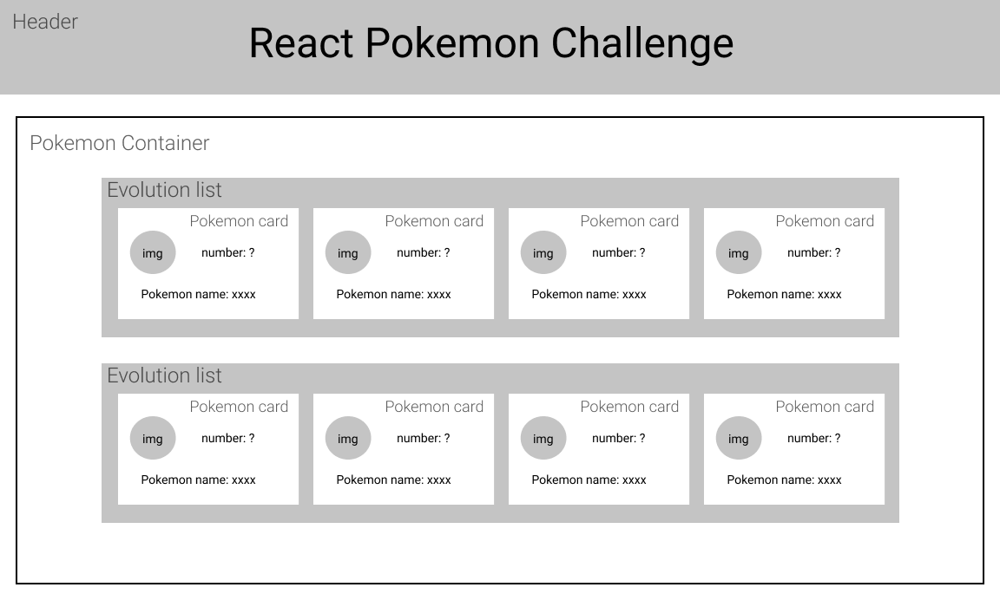

## React Pokemon Challenge

### Implimentation steps
1. Mock & Component Hierarchy
2. Get all needed data from API server
    * Pokemon name
    * Pokemon image
    * Pokemon id
    * Pokemon evolution forms
3. Build Static version of app
4. Build Dynamic version of app
    * Display real data
    * Show loading when image load
5. Add gh-page

### Mock & Component Hierarchy

### Time consuming
1. Create environment & Mock & Component Hierarchy - 40 min; Most time consuming tasks:
    * Webpack config
2. Get all needed data from API server in needed form - 70 min; Most time consuming tasks:
    * Recursively get all pokemon forms
    * Get only unique pokemon in order to render evolution lists
3. Build Static version of app - 40 min; Most time consuming tasks:
    * Layout
    * Add Skeleton loader
    * PropTypes && Default Props
4. Build Dynamic version of app - 100 min; Most time consuming tasks:
    * Pokemon avatar preloader
    * Change needed form data from API server
    * Load evolution lists depending on user scroll
    * Refactoring
5. Add gh-page;

**Total time: 250 min or 4 hours 10 min**

**You can see the result [here](https://nazim-k.github.io/pokemon/)**